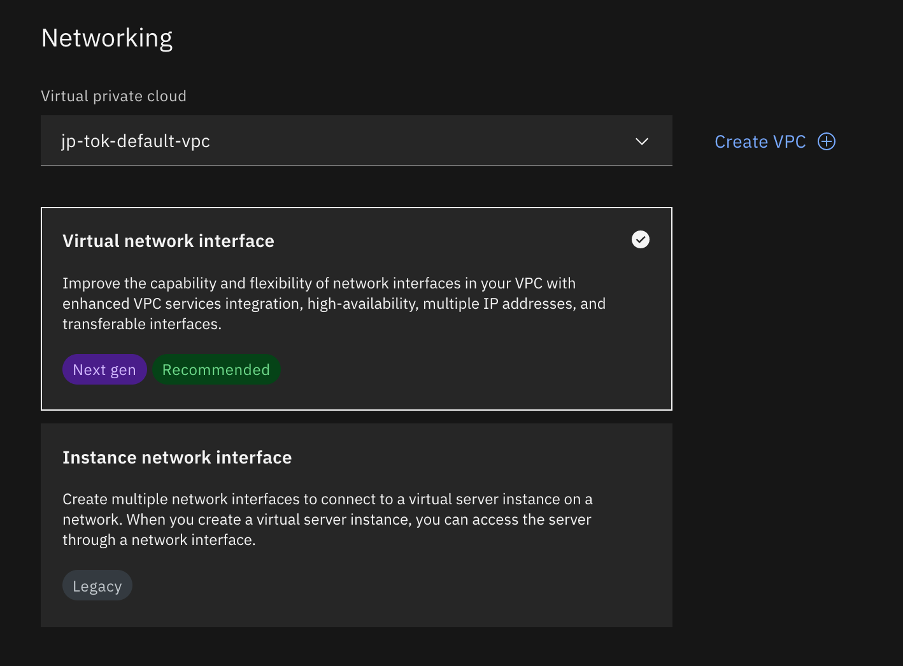
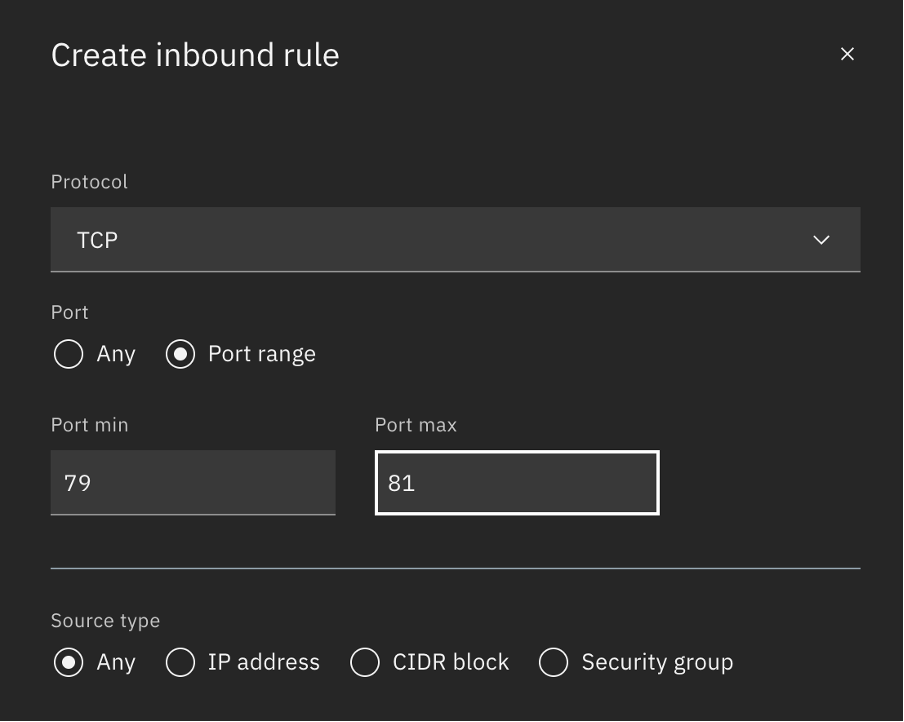

**Deploying Multimodal LLM on IBM Cloud VPI (GPU)**

Ah! What an exciting time we live in, magic of Foundational models is
swaying the world and its getting easier and easier every day to get
access to Gen AI models. Today we are going to look at a simple tutorial
on how to run LLava on IBM Cloud VPI.

**Step1: Getting the environment ready.**

For this setup we will be using IBM Cloud. Here are the following
components we will be provisioning and using:

-   Ubuntu 22.04 - 16 vCPU \| 80 GiB \| 1 x NVIDIA L4 24 GB Virtual
    server instances

    -   Provisioning a VSI auto create the following for us:

        -   A VPC attached to it.

        -   A security group governing the above VPC.

-   A Floating IP in the same region and region to expose our app to
    Internet.

Provision a VSI from [here](https://cloud.ibm.com/vpc-ext/provision/vs):

-   Give the instance a name.

-   For image options pick the following:

    -   ibm-ubuntu-22-04-4-minimal-amd64-1, its available in page 4
        during the time of tutorial creation

-   For Profile go for a Balanced 4 vCPU and 16GB RAM

Although Llava -- 7b can run in 8G of RAM and CPU only, it's extremely
slow hence going with the above configuration after numerous test runs.

-   Do not forget to generate a SSH Key specific to this machine which
    you will be using to login. you just have to click on create ssh key
    and give a name to the key, it will be auto generated and downloaded
    for you.

For Networking, choose "Virtual network Interface" and let it create one
for us

That's it, go ahead and create the Virtual Server and wait for the
provisioning to be complete.

**Step 2: Setup the networking**

Before we go ahead and access the cluster, let us also setup the
networking so we can get it out of the way.

**Step 2a: Getting a Floating IP**

-   The instance does not come with a Floating IP, so let's get one

-   From the Menu side bar, navigate to Floating IP under Network

-   Click on Reserve and make sure you select the same zone as the one
    you chose for the instance, so you can see it listed in the resource
    to bind drop down.

-   Click on reserve to assign the Floating IP to our instance.

**Step 2b: Allow inbound on Port 80**

Our app will be deployed on port 80 so it can be accessed without any
redirection. Although the required fire wall setting on the machine are
taken care by the script, we still have to manually add a inbound rule
to the security policy created.

-   Navigate to [security groups for
    VPC](https://cloud.ibm.com/vpc-ext/network/securityGroups)

-   Pick the group that is assigned to our instance (you can find it
    tagged in the instance details) and navigate to Rules.

-   Add a new TCP Inbound Rule to allow traffic on port 80

That's it we are all setup to now move to the application side.

**Step 3: Accessing the cluster.**

-   Once the above steps are followed, open the terminal and navigate to
    the folder where you have downloaded the ssh key

-   Update the permissions on the key to allow ssh connect.

> \`chmod 400 \<path to your pem file\> \`

-   Now ssh into the cluster using the following command.

> \`ssh -i \<path to your pem file\> root@\<Floating IP\>

-   Say yes when asked to add the key to known hosts.

**Step 3: Installing Pre-reqs**

I've setup a quick script that will take care of installing all the
necessary libraries and tools for you, and a flask application to give
you access to the model over a UI / API. Let's see how to get it.

-   Get the required scripts.

> \`git clone
> [https://github.com/krishnac7/projectHeimdall\`](https://github.com/krishnac7/Llaminator%60)

-   Then cd into it

> \`cd projectHeimdall\`

-   Set up file permissions.

> \` chmod +x install_run_cloud.sh\`

-   Run the setup files.

> \`./install_run_cloud.sh\`

-   Wait for the setup process to complete, it can take up to a minute
    or two, but once you see the below screen, you are all set!

> PS: if it asks for some manual input especially during
> update-initramfs step, go ahead and hit enter till you see the console
> again and the process continues

**Step 4: Accessing the UI**

-   Open the url

\`http://\<Floatingc ip \>\`to access the UI

You can still use these private deployments along with
Watsonx.governance to ensure you are giving your clients the best of the
class experience and promoting use of #responsibleai.

Do let me know your thoughts and how you've been using this in your
client demos ☺
